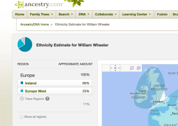

Several years ago, in 2005, when I was first getting into genealogy I was excite to learn that DNA was being used to help family historians determine their background and get in contact with people that shared common Ancestors.  I immediately found FamilyTreeDNA and requested a 37-marker test.  I received the results and joined the "Wheeler" project.

In 2005, using DNA for genealogy was extremely new and unless you had some experience with the technology or you had someone to interpret the results for you, the value of DNA may have been limited.  I was able to make contact with several individuals that I matched in the Wheeler Surname Project but it didn't live up to my expectations.  In 2008, I upgraded from 37 to 63 markers.  I experienced similar results to that of my original results in that I had received results but how to use them and get in touch with others was limited.  I reached out to a number of people that I had reported matches but many of them maintained paper records or family trees in GEDCOM format offline.  In most cases I was unable to determine the shared ancestor.

Ancestry.com has since added DNA testing and the autosomal DNA which allows me to get DNA results from both my mother and father's ancestry (my previous two tests only had results from my father's line).

After completing the swab and waiting for the results for about 4 weeks, the results were available within my Ancestry.com account.

As you can see from the image, the results provided some insight as to where my ancestors came from (which all eventually leads back to Africa).  My results indicated that the majority of my ancestry (66%) was from Ireland.  Another 23% made up ancestry from England, Germany, France and other western European nations.  Ancestry.com does a great job of explaining how the estimates are determined and presenting various different views into the information.  A separate page provides links to cousins found on Ancestry.com.

I have posted during the 52 Ancestors challenge about my 2nd great grandfather, Andrew Kinney.  I have been working on and off on the Kinney line.  At one time, after finding each other on a family surname bulletin board, we suspected that Andrew was one of four brothers that had come to the United States together.  After having a difficult time confirming that there was a possibility that these four gentlemen were related, I stopped pursuing the research.  It's been over 5 years since I have had any regular contact with the Kinney working group.

I was recently contacted through Ancestry.com by one of my matches.  One of the members of our Kinney working group who is a descendent of one of the brothers recently had an AncestryDNA test completed and it turns out that we are a match.

Guess they were brothers after all!
