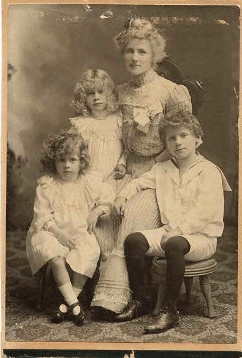

Yes, it has been too long.  Time seems to be get away from us.  Genealogy filing stacks up which is what led to this post.  I've had some family photos that needed scanning such as the the photo below.

The back of the photograph has the caption "Mother - Harry - Odette - Honore".

Mother is Elizabeth Speers (nee Green) Mackenzie. "Lizzie" (b. 7 Feb 1867; d. 29 Jan 1958) was born in Dundee, Angus, Scotland and passed away in Kenora, Ontario, Canada.

Harry is Harry Stuart Mackenzie (b. 25 Jun 1893; d. 24 Aug 1918).  Harry was a member if the Canadian Infantry (Manitoba Regiment) and passed away fighting in World War I in France.  He is buried in Hillside Cemetery , Le Quesnel, Somme, Picardie, France.

The young lady in the top is Odette Henrietta Mackenzie (b. 16 Nov 1894; d. aft. 1940).  Odette married a prominent doctor, Dr. Albert E. Ady.  Odette is presumed to have passed away in Iowa.

The young lady in the first row is my grandmother, Honore Millicent Mackenzie (b. 7 Nov 1898; d. 27 Sep 1991).  Honore married Howard Robinson Wheeler in Winnipeg and had their first child (William Stamford Wheeler).   Howard and Honore eventually immigrated to the Unites States in International Falls, Minnesota.
